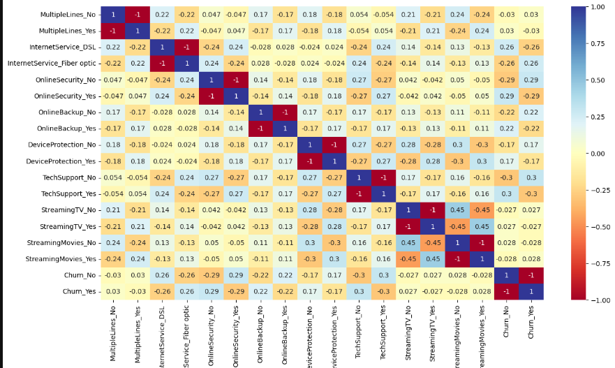

# PwC--Retention-Analysis using powerBI and Python
## Introduction
In this analysis, I worked with a telecom dataset aimed at predicting customer churn. The objective was to clean the data, remove irrelevant or redundant columns, handle missing values, and determine the correlation between various service-related variables and customer churn. This process involved several key steps, from uploading the data to conducting a correlation analysis, which I'll outline below.
## Step 1: Uploading the Dataset
First, I uploaded the dataset into the Python environment using the Pandas library. Pandas is a powerful tool for data manipulation and analysis.

import pandas as pd
import numpy as np
df =pd.read_excel(r"C:\Users\USER\Desktop\yemmite\PwC Internship\PhoneNow.xlsx")
df.head() --> to show the first 5 rows of my dataset

## Step 2: Handling Missing Values
Handling missing values is crucial for ensuring the accuracy of our analysis. I began by checking for any null values in the dataset.

df.info() ---> To show information of my data if it has null values or not

df.dropna() ---? to drop null values in my data 

I found that some columns are not beeded for the analysis . These were handled as follows:

Dropping Columns: I dropped columns that are  irrelevant to the analysis to prevent redundancy

df.drop(['column_1', 'column_2', ....], axis=1, inplace=True)

## Step 3: Finding Correlations

With a clean dataset, I proceeded to calculate the correlation between the independent variables (like MonthlyCharges, tenure, etc.) and the target variable Churn. This helps in identifying which factors are most strongly associated with customer churn.

data = pd.get_dummies(df) ---> Convert categorical columns to numerical values

## Step 4: Plotting the Correlation Heatmap
To better visualize the correlations among all variables, I plotted a heatmap using the Seaborn library. A heatmap provides a clear visual representation of the relationships between variables, making it easier to identify which factors are most closely associated with churn.

import seaborn as sns
import matplotlib.pyplot as plt

plt.figure(figsize=(12, 8)) --->  Set the size of the plot

sns.heatmap(data, annot = True, cmap = 'RdYlBu')

## Further Analysis in Power BI
Following the Python analysis, I extended the exploration of categorical variables such as Contract and Tenure using Power BI. Power BI's powerful visualization capabilities allowed me to dive deeper into these variables, revealing patterns and trends that are crucial for understanding customer behavior and developing effective retention strategies.

