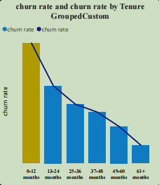
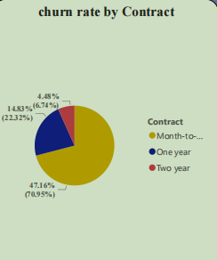

# PwC--Retention-Analysis using powerBI and Python
## Introduction
In this analysis, I worked with a telecom dataset aimed at predicting customer churn. The objective was to clean the data, remove irrelevant or redundant columns, handle missing values, and determine the correlation between various service-related variables and customer churn. This process involved several key steps, from uploading the data to conducting a correlation analysis, which I'll outline below.
## Step 1: Uploading the Dataset
First, I uploaded the dataset into the Python environment using the Pandas library. Pandas is a powerful tool for data manipulation and analysis.

import pandas as pd
import numpy as np
df =pd.read_excel(r"C:\Users\USER\Desktop\yemmite\PwC Internship\PhoneNow.xlsx")
df.head() --> to show the first 5 rows of my dataset

## Step 2: Handling Missing Values
Handling missing values is crucial for ensuring the accuracy of our analysis. I began by checking for any null values in the dataset.

df.info() ---> To show information of my data if it has null values or not

df.dropna() ---? to drop null values in my data 

I found that some columns are not beeded for the analysis . These were handled as follows:

Dropping Columns: I dropped columns that are  irrelevant to the analysis to prevent redundancy

df.drop(['column_1', 'column_2', ....], axis=1, inplace=True)

## Step 3: Finding Correlations

With a clean dataset, I proceeded to calculate the correlation between the independent variables (like MonthlyCharges, tenure, etc.) and the target variable Churn. This helps in identifying which factors are most strongly associated with customer churn.

data = pd.get_dummies(df) ---> Convert categorical columns to numerical values

## Step 4: Plotting the Correlation Heatmap
To better visualize the correlations among all variables, I plotted a heatmap using the Seaborn library. A heatmap provides a clear visual representation of the relationships between variables, making it easier to identify which factors are most closely associated with churn.

import seaborn as sns
import matplotlib.pyplot as plt

plt.figure(figsize=(12, 8)) --->  Set the size of the plot

sns.heatmap(data, annot = True, cmap = 'RdYlBu')

## Further Analysis in Power BI
Following the Python analysis, I extended the exploration of categorical variables such as Contract and Tenure using Power BI. Power BI's powerful visualization capabilities allowed me to dive deeper into these variables, revealing patterns and trends that are crucial for understanding customer behavior and developing effective retention strategies.

              

From the heatmap, we can observe the following recommendations based on the correlation with Churn (Yes):

Tech Support and Online Security: Both TechSupport_Yes and OnlineSecurity_Yes show a negative correlation with churn. Customers who use these services are less likely to churn. This suggests that enhancing or promoting these services could be an effective strategy to retain customers.

Internet Service Type: InternetService_Fiber optic shows a positive correlation with churn. Customers with fiber optic services are more likely to churn compared to those using DSL. It might be beneficial to investigate the reasons behind this trend, such as pricing or service issues, and address them.

Streaming Services: StreamingMovies_Yes and StreamingTV_Yes also show a moderate negative correlation with churn. Offering attractive streaming packages or bundling them with other services could potentially reduce churn rates.

Device Protection and Online Backup: Both DeviceProtection_Yes and OnlineBackup_Yes have a slight negative correlation with churn, indicating that customers who opt for these services are slightly less likely to churn. Promoting these services as value additions could help in retaining customers.

These insights suggest focusing on improving service offerings and customer satisfaction in these areas to reduce churn.

## Insights from the PowerBi Dashbuard Analysis

Churn Rate by Tenure:

Customers with shorter tenures (0-12 months) exhibit the highest churn rate. The churn rate significantly decreases as the tenure increases, with customers who have been with the company for more than 61 months showing the lowest churn rate.

Churn Rate by Gender and Contract Type:

Male customers on month-to-month contracts have the highest churn rate compared to those on one-year or two-year contracts. Female customers also show a similar trend but with slightly lower churn rates.
Customers on month-to-month contracts have a significantly higher churn rate compared to those on one-year or two-year contracts, indicating that contract length influences customer retention.
Average Monthly Charges:

The average monthly charges for all customers and those who have churned are quite similar ($81.52 for all customers vs. $82.25 for churned customers). This suggests that higher monthly charges might contribute to churn but is not the sole factor.
Revenue and Churn:

The company has retained $11.30M in revenue, but churn has caused a loss of $2.7M. This highlights the financial impact of churn and the importance of customer retention strategies.
Churn Rate:

The overall churn rate is 32.8%, which is relatively high and indicates that nearly one-third of the customer base has churned.
Average Tenure of Churned Customers:

The average tenure of churned customers is 18.9 months, indicating that customers are most likely to churn within the first two years of their contract.

## Recommendations
Focus on Retaining New Customers:

Since the churn rate is highest among customers with a tenure of 0-12 months, implementing targeted retention strategies for new customers is crucial. Offering incentives, personalized services, or loyalty programs early in the customer lifecycle could help reduce churn.
Promote Longer Contracts:

Given that customers on month-to-month contracts are more likely to churn, encouraging customers to switch to one-year or two-year contracts could improve retention. Offering discounts or additional benefits for longer-term contracts could be an effective strategy.
Analyze Pricing Strategies:

Although the average monthly charges are similar for all customers and those who have churned, it's worth exploring if price sensitivity is a factor for specific customer segments. Tailoring pricing strategies or offering more flexible payment plans might help reduce churn.
Enhance Customer Engagement for Male Customers:

Since male customers have a higher churn rate, especially those on month-to-month contracts, consider targeted engagement efforts such as personalized communication, tailored offers, and improving service quality for this demographic.
Monitor and Improve Customer Experience:

Given the financial impact of churn, continuously monitoring customer satisfaction and addressing pain points proactively is essential. Implementing customer feedback loops and addressing issues promptly can help in retaining customers.
These recommendations, if implemented effectively, could help in reducing the churn rate, improving customer retention, and ultimately boosting the company's revenue.
